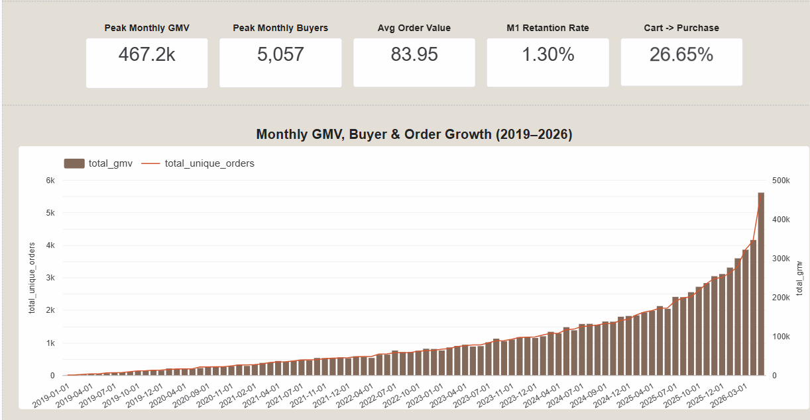
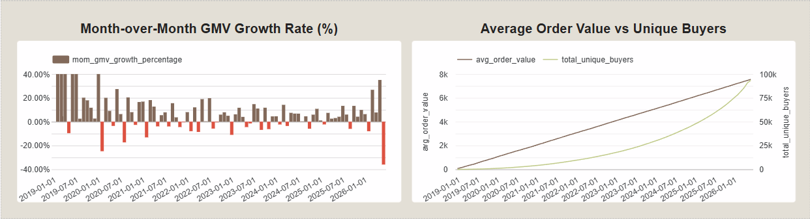
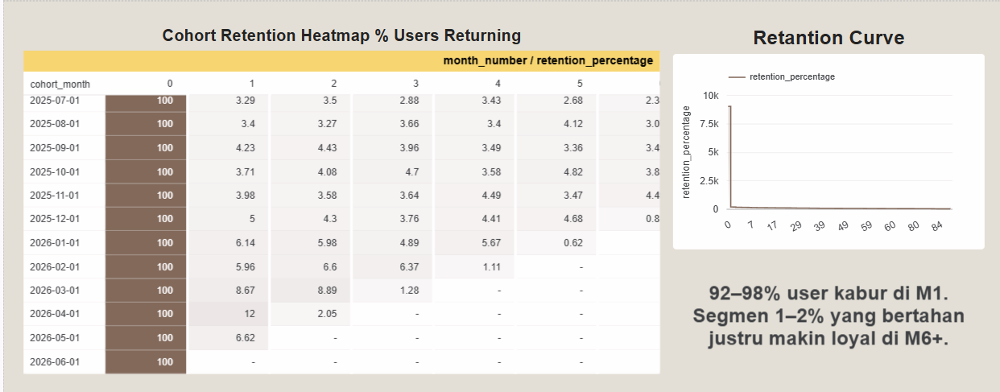
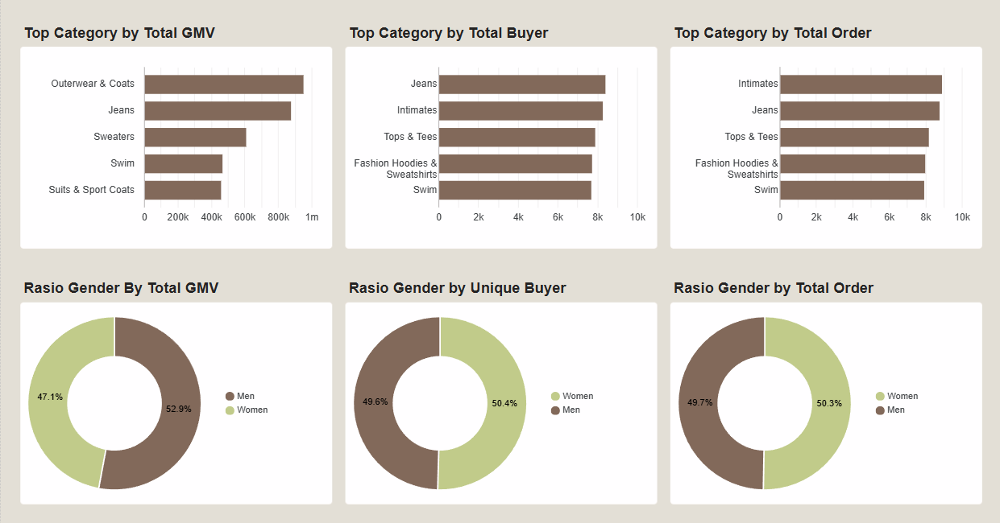
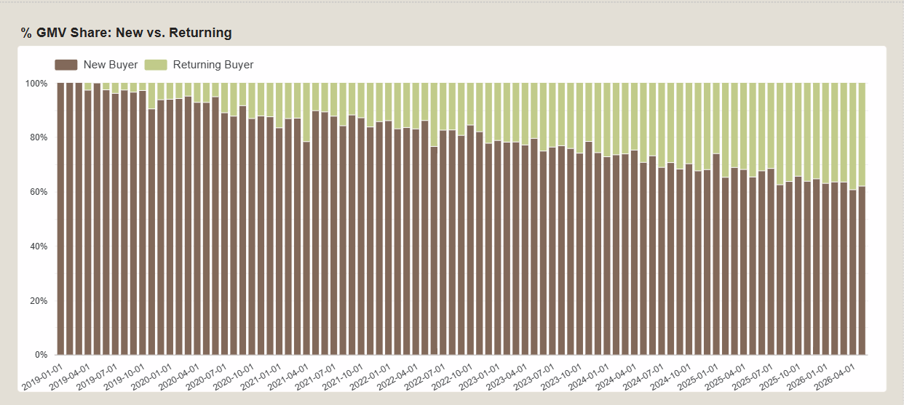
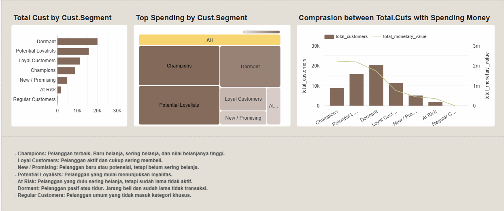
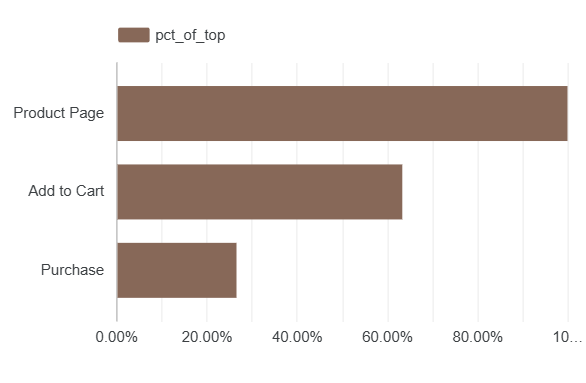
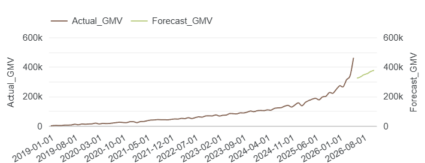

# TheLook E-Commerce Analytics: Growth, Retention, Funnel, RFM & Forecasting

I built this project to practice the full data analyst workflow on a real e-commerce dataset. Not just writing SQL queries, but actually thinking through what the numbers mean and what a business should do about it.

The dataset is TheLook a simulated e-commerce store available as a BigQuery public dataset. I ran everything from BigQuery SQL through Python forecasting and ended up building a Looker Studio dashboard to tie it all together.

**→ [Live Dashboard](https://datastudio.google.com/reporting/4305cf69-83f3-483c-b8dc-3e02a43edca3)**

---

## What I Was Trying to Figure Out

These were the actual questions I started with before touching the data:

1. Is this business growing consistently, or is it just noisy month-to-month?
2. What's actually driving GMV growth. more buyers, more orders, or people spending more per order?
3. How much of GMV comes from new customers vs. people who've bought before?
4. Which product categories matter most?
5. Are male and female customers equally valuable to the business?
6. Do customers come back after their first purchase and if not, how bad is the leak?
7. Which types of customers are worth the most?
8. Where exactly are people dropping off before they buy?
9. Which traffic sources are actually converting not just sending traffic?
10. Where's GMV probably headed over the next six months?

---

## Stack

| Tool | What I used it for |
|---|---|
| Google BigQuery | Querying and aggregating transaction + event data |
| SQL | Growth metrics, cohort analysis, funnel logic, RFM scoring |
| Python / Google Colab | Time-series forecasting |
| Prophet | Monthly GMV forecasting with seasonality |
| Looker Studio | Dashboard for visualization and storytelling |

---

## Dataset

| | |
|---|---|
| Source | `bigquery-public-data.thelook_ecommerce` |
| Period | January 2019 – May 2026 |
| Core tables | `order_items`, `orders`, `events` |
| Supporting tables | `products`, `users` |
| Type | Simulated e-commerce transaction and clickstream data |

One thing worth flagging upfront: **June 2026 data is incomplete**: the extraction happened when the month was only 6 days old, so there's a visible drop at the end of every time-series chart. That's not a real business decline. Everything I conclude is based on May 2026 as the most recent full month.

---

## Quick KPI Snapshot

| KPI | Value |
|---|---:|
| Peak Monthly GMV | $467,200 |
| Peak Monthly Buyers | 5,057 |
| Average Order Value | $83.95 |
| Month-1 Retention Rate | 1.30% |
| Cart-to-Purchase Conversion | 26.65% |
| Avg Forecast GMV (Jun–Nov 2026) | $355,800 |
| Peak Forecast GMV | $376,900 |

The two numbers that really stuck with me: **$467K peak GMV** and **1.30% Month-1 retention**. The business knows how to get customers. It just struggles to keep them.

---

## A Note on What GMV Actually Means Here

Because the dataset doesn't include shipping costs, voucher costs, seller commissions, advertising spend, or platform fees, the GMV figures here are basically **total valid sales revenue**, not marketplace profit. I excluded cancelled and returned orders. AOV is just GMV divided by order count.

| Metric | How I defined it |
|---|---|
| GMV | Total `sale_price` from non-cancelled, non-returned orders |
| AOV | GMV ÷ unique orders |
| New Buyer | First purchase happened this month |
| Returning Buyer | Had at least one prior purchase before this month |
| Cohort | Grouped by month of first purchase |
| Retention Rate | % of a cohort who purchased again in a later month |
| Funnel Conversion | % of sessions reaching each stage in sequence |

---

## Part 1: Is the Business Growing?

**`sql/milestone1_business_growth.sql`**[sql/milestone1_business_growth.sql](sql/milestone1_business_growth.sql)

Short answer: yes. GMV trended upward from 2019 through May 2026, with May 2026 being the strongest full month on record.

But what's more interesting is *how* it grew. Average Order Value barely moved it stayed around **$80–84 the entire time**. So the growth wasn't because customers started spending more per order. It was almost entirely because there were **more customers and more orders**. The basket size didn't change. The business just got more traffic through the door.

That's not a bad thing, but it does suggest there's an untapped lever here. If you could nudge AOV up even slightly through bundling, free shipping thresholds, or recommendations. The revenue impact would compound across a growing buyer base.




---

## Part 2: Do Customers Actually Come Back?

**`sql/milestone1_cohort_retention.sql`**[sql/milestone1_cohort_retention.sql](sql/milestone1_cohort_retention.sql)

This one was a bit uncomfortable to look at.

Month-1 retention sits at **1.30%**. Which means if you take a group of customers who bought for the first time in any given month, only about 1 in 77 of them comes back the following month. The other 98–99 are gone.

There is a silver lining: among the small slice that does return, repeat purchase behavior does persist into later months. So the platform isn't fundamentally broken, there's just a huge drop-off right after the first purchase that nobody seems to be catching.

At 1.30%, the business is essentially running an acquisition-only model. Which works while acquisition scales, but gets expensive and fragile over time. Post-purchase CRM, even something simple like a Day 3 recommendation email and a Day 7 voucher, would likely move this number meaningfully.

**Goal:** Get Month-1 retention from 1.30% to at least 5% within 3 months of launching any structured follow-up program.



---

## Part 3: Which Categories and Genders Are Driving Performance?

**`sql/milestone4_category_gmv_aov.sql`** [sql/milestone4_category_gmv_aov.sql](sql/milestone4_category_gmv_aov.sql)

Not all categories behave the same way, and I think that matters a lot for how the business should prioritize:

- **Outerwear & Coats**: highest total GMV. High-ticket items, probably lower purchase frequency
- **Jeans**: strong on both GMV and buyer count. A reliable volume-and-value driver
- **Intimates**: led the leaderboard on total order count. High frequency, probably lower AOV per order

Gender split was actually pretty balanced in terms of buyers and orders. There was a small GMV gap, but nothing dramatic. The platform isn't skewed toward one gender, which is useful to know if you're thinking about where to invest marketing.

The bigger takeaway here is that different categories need different strategies. Outerwear probably needs premium positioning and margin focus. Intimates is a repeat-purchase engine that should be pushed toward subscriptions or loyalty mechanics.



---

## Part 4: New Buyers vs. Returning Buyers

**`sql/milestone4_new_vs_returning_buyer.sql`**[sql/milestone4_new_vs_returning_buyer.sql](sql/milestone4_new_vs_returning_buyer.sql)

Early in the data, new buyers dominated GMV almost entirely. Over time, returning buyer contribution grew which is a good sign, it means a portion of the base is actually sticking around.

But this doesn't resolve the retention problem from Part 2. The returning buyers that exist are probably a surviving subset of a much larger original cohort. The majority of first-time buyers still never come back.

What this tells me is that the loyalty loop *can* exist — it just only activates for a small slice of customers. The question is whether you can widen that funnel. A structured first-time buyer journey (welcome → cross-sell → discount → reminder) is the most direct way to test it.



---

## Part 5: Which Customers Are Worth the Most? (RFM)

**`sql/milestone4_rfm_customer_segmentation.sql`**[sql/milestone4_rfm_customer_segmentation.sql](sql/milestone4_rfm_customer_segmentation.sql)

I segmented customers using RFM — Recency, Frequency, and Monetary value, into seven buckets:

| Segment | Who they are |
|---|---|
| Champions | Most recent, most frequent, highest spend |
| Loyal Customers | Active buyers with solid purchase history |
| New / Promising | Recent first-timers with potential |
| Potential Loyalists | Showing early repeat behavior |
| At Risk | Used to be active, gone quiet recently |
| Dormant | Low frequency, haven't bought in a while |
| Regular Customers | Middle-of-the-road, don't fit a specific pattern |

The biggest segment by count was **Dormant**. Which means the majority of the customer base has already disengaged.

Champions and Potential Loyalists were much smaller groups but generated disproportionately high spend. That gap between headcount and revenue contribution is exactly why you can't treat all customers the same in CRM.

My take on how to approach each:
- **Champions** → VIP perks, early access, personal treatment
- **Potential Loyalists** → Personalized recs, second-purchase nudges
- **At Risk** → Reactivation offers with urgency
- **Dormant** → Low-cost automated flows only. The ROI of heavy investment here is low



---

## Part 6: Where Are Users Dropping Off?

**`sql/milestone2_funnel_overview.sql`**[sql/milestone2_funnel_overview.sql](sql/milestone2_funnel_overview.sql)
· **`sql/milestone2_funnel_by_traffic_source.sql`**[sql/milestone2_funnel_by_traffic_source.sql](sql/milestone2_funnel_by_traffic_source.sql)

I used strict session-level funnel logic: a session only counts as converted if the user moves through the stages in the right order: product page → add to cart → purchase.

| Stage | Sessions | % of Entry | Drop-off |
|---|---:|---:|---:|
| Product Page | 681,667 | 100% | — |
| Add to Cart | 432,099 | 63.4% | 36.6% |
| Purchase | 181,667 | 26.7% | **58.0%** |

The big leak is between cart and purchase. Nearly **6 in 10 people who added something to their cart didn't complete the purchase**. Product discovery isn't the problem, people are finding things and expressing intent. They're just not finishing at checkout.

My guess (and it's an inference, since we don't have detailed checkout event data): friction at checkout. Unexpected shipping costs, too many steps, limited payment options. These are fixable.

On traffic sources: Email drove the most sessions, YouTube showed stronger purchase conversion quality. But I can't responsibly say "shift budget to YouTube" without CAC and ad spend data, which this dataset doesn't include.

**Goal:** Get cart-to-purchase drop-off below 50%. The fix is checkout UX, not more traffic.



---

## Part 7: Where Is GMV Headed?

**`notebooks/milestone3_gmv_forecasting.ipynb`** [notebooks/milestone3_gmv_forecasting.ipynb](notebooks/milestone3_gmv_forecasting.ipynb)

I trained a Prophet model on January 2019, May 2026 monthly GMV and forecasted the next six months.

| Month | Forecast | Lower | Upper |
|---|---:|---:|---:|
| Jun 2026 | $323,322 | $301,414 | $343,578 |
| Jul 2026 | $331,799 | $309,853 | $353,218 |
| Aug 2026 | $346,765 | $326,753 | $368,871 |
| Sep 2026 | $354,523 | $332,077 | $373,626 |
| Oct 2026 | $369,132 | $347,850 | $390,936 |
| Nov 2026 | $376,897 | $353,809 | $397,807 |

The trend continues upward peaking around $377K in November. That's about 80% of the May 2026 actual peak, which suggests the high months are still seasonal exceptions, not the new floor.

One thing I want to be honest about: a tight confidence interval doesn't automatically mean the model is accurate. The notebook includes backtesting against a naive baseline using MAE, RMSE, and MAPE, because a forecast is only useful if you know how wrong it tends to be.

This should be read as a directional estimate. It doesn't know about upcoming campaigns, pricing changes, stock issues, or macroeconomic shifts.



---

## What I'd Actually Recommend (If This Were a Real Business)

**1. Fix retention before scaling acquisition**
98% of first-time buyers don't come back the next month. A basic post-purchase sequence: Day 1 confirmation with recs, Day 7 voucher, Day 14 reminder would likely move this more than any amount of new ad spend.

**2. Fix checkout, not traffic**
The funnel tells you where the problem is: not at product discovery, but at purchase completion. Guest checkout, visible shipping costs, one-click payment for returning users, 30-minute cart abandonment email. These are high-impact, relatively low-cost fixes.

**3. Build a first-time buyer journey**
New buyer GMV share is large. Returning buyer GMV is growing but still small. There's a clear opportunity to build a structured lifecycle: welcome, educate, incentivize, remind — to close that gap faster.

**4. Treat customer segments differently**
Champions and Potential Loyalists punch above their weight. Dormant customers are unlikely to respond to heavy investment. RFM exists exactly so you can stop wasting budget on the wrong segments.

**5. Stop treating all categories the same**
Outerwear needs premium positioning. Intimates needs repeat-purchase mechanics. Category strategy should follow the data, not a one-size-fits-all playbook.

**6. Don't reallocate channel budget without cost data**
YouTube's conversion rate looks good in the funnel. But conversion rate alone doesn't make a channel worth more investment. You need CAC, ROAS, and LTV before making that call.

---

## What This Analysis Can't Tell You

A few honest caveats:

The dataset is simulated so none of these numbers reflect the actual performance of any real marketplace.

It's also missing a lot of cost-side context: no voucher costs, no shipping fees, no seller commissions, no ad spend, no CAC, no product margin. So GMV here is purely a revenue proxy you can't infer profitability from it.

The checkout drop-off finding is an inference. I can see that people leave between cart and purchase, but the dataset doesn't have detailed checkout step events (payment page, shipping selection, voucher errors). The *cause* of the drop-off is educated speculation, not proven by the data.

RFM labels are relative scores from this dataset: not permanent customer identities. They're useful for prioritization, not as fixed truths.

---

## Repository Structure

```text
TheLook-E-Commerce-Growth-Retention-RFM-Funnel-Forecast-Analysis/
├── README.md
├── requirements.txt
├── .gitignore
├── COMMIT_MESSAGE.txt
│
├── sql/
│   ├── milestone1_business_growth.sql
│   ├── milestone1_cohort_retention.sql
│   ├── milestone2_funnel_by_traffic_source.sql
│   ├── milestone2_funnel_overview.sql
│   ├── milestone3_gmv_monthly_extract.sql
│   ├── milestone4_category_gmv_aov.sql
│   ├── milestone4_new_vs_returning_buyer.sql
│   ├── milestone4_rfm_customer_segmentation.sql
│   ├── milestone5_cart_abandonment_by_source.sql
│   ├── milestone5_category_repeat_purchase.sql
│   └── milestone5_cohort_retention_by_source.sql
│
├── notebooks/
│   ├── forecasting_evaluation_template.py
│   └── milestone3_gmv_forecasting.ipynb
│
├── data/
│   ├── cohort_retention.csv
│   ├── forecast_looker.csv
│   ├── funnel_by_traffic_source.csv
│   ├── funnel_overview.csv
│   ├── growth_monthly.csv
│   ├── milestone4_category_gmv_aov.sql.csv
│   ├── milestone4_new_vs_returning_buyer.sql.csv
│   ├── milestone4_rfm_customer_segmentation.sql.csv
│   ├── milestone5_cart_abandonment_by_source.sql.csv
│   ├── milestone5_category_repeat_purchase.sql.csv
│   └── milestone5_cohort_retention_by_source.sql.csv
│
├── assets/
│   ├── funnel_overview.png
│   ├── growth_gmv.png
│   ├── milestone_2.png
│   ├── milestone_3.png
│   ├── mom_gmv_growth.png
│   ├── new_vs_returning_buyer.png
│   └── rfm_segmentation.png
│
├── docs/
│   ├── assets/
│   ├── dashboard_export.pdf
│   ├── index.html
│   ├── limitations.md
│   ├── metric_definitions.md
│   ├── repository_cleanup_guide.md
│   ├── script.js
│   └── style.css
│
└── scripts/
    └── organize_repo.sh
```

## How to Run It

1. Open BigQuery and run the SQL files in `sql/` in order
2. Export results as CSV into `data/`
3. Open the forecasting notebook in Google Colab and run it end to end
4. Connect the CSVs to Looker Studio and build the dashboard sections
5. Export dashboard screenshots into `assets/`

---

**Achmad Faishal**  
Ekonomi Pembangunan — FEB UPN "Veteran" Yogyakarta

[](https://www.linkedin.com/in/achmad-faishal-062313274/)
[](https://datastudio.google.com/reporting/4305cf69-83f3-483c-b8dc-3e02a43edca3)
