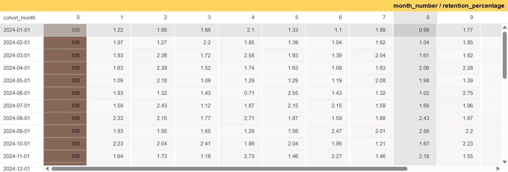
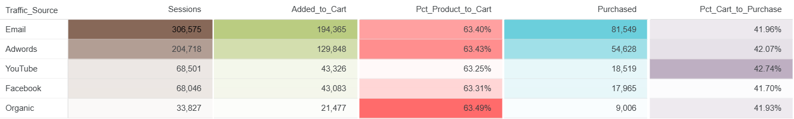

# 📦 TheLook E-Commerce: End-to-End Analytics

> Growth · Cohort Retention · Conversion Funnel · GMV Forecasting · Marketplace Business Insight


## Project Overview

This project is an end-to-end e-commerce analytics case study using Google BigQuery public dataset `bigquery-public-data.thelook_ecommerce`. The analysis simulates how a marketplace data analyst investigates business growth, customer retention, conversion funnel leakage, channel quality, and GMV forecasting.

The project covers the full analytics workflow: SQL-based data extraction in BigQuery, cohort retention analysis, session-level funnel analysis, Python-based time-series forecasting, and executive dashboard storytelling in Looker Studio.

**Live Dashboard:** [View in Looker Studio](https://datastudio.google.com/reporting/4305cf69-83f3-483c-b8dc-3e02a43edca3)

## Business Questions

This project answers four main business questions:

1. Is the e-commerce business growing consistently over time?
2. Is GMV growth driven by higher order value or by more buyers?
3. Where do users drop off the most in the product-to-purchase journey?
4. How much GMV can be expected in the next six months based on historical trends?

## Tools & Tech Stack

| Tool | Usage |
|---|---|
| Google BigQuery | Querying and aggregating large-scale e-commerce data |
| SQL | Growth metrics, cohort retention, funnel analysis, segmentation |
| Python / Google Colab | Time-series forecasting and model evaluation |
| Prophet | Monthly GMV forecasting |
| Looker Studio | Executive dashboard and stakeholder communication |

## Dataset

| Item | Description |
|---|---|
| Source | `bigquery-public-data.thelook_ecommerce` |
| Platform | Google BigQuery Public Dataset |
| Data Period | January 2019 – May 2026 |
| Main Tables | `order_items`, `orders`, `events` |
| Optional Enrichment Tables | `products`, `users` |
| Data Type | Simulated e-commerce transaction and clickstream data |

## Metric Definitions

| Metric | Definition |
|---|---|
| GMV Proxy | Total `sale_price` from valid order items, excluding `Cancelled` and `Returned` items |
| AOV | GMV divided by number of unique orders |
| Unique Buyers | Number of distinct users with valid transactions |
| MoM Growth | Month-over-month percentage change |
| Cohort Month | User's first valid purchase month |
| Retention Rate | Percentage of users from a cohort who made another valid purchase in later months |
| Funnel Conversion | Percentage of sessions moving from product view to cart and purchase |
| Drop-off Rate | Percentage of sessions lost between funnel stages |

Important note: because this dataset does not include voucher cost, shipping fee, payment fee, seller commission, platform subsidy, and advertising spend, GMV in this project should be interpreted as a net merchandise sales proxy, not full marketplace GMV.

## Milestone 1 — Business Growth & Cohort Retention

**SQL Files:**

- [`sql/milestone1_business_growth.sql`](sql/milestone1_business_growth.sql)
- [`sql/milestone1_cohort_retention.sql`](sql/milestone1_cohort_retention.sql)

### What Was Analyzed

The first milestone measures GMV proxy, total orders, unique buyers, AOV, GMV per buyer, and month-over-month growth. It also analyzes cohort retention to understand whether new customers return after their first purchase.

### Key Findings

- GMV increased from a very small base in January 2019 to hundreds of thousands of dollars per month by May 2026.
- AOV remained relatively stable around the $80–90 range.
- This suggests that GMV growth was mainly driven by a higher number of buyers and orders, not by higher basket size.
- Month-1 retention was only around 1–2%, meaning most customers purchased once and did not return in the following month.
- A small group of retained users continued to show repeat purchasing behavior, indicating that the platform has repeat-purchase potential but weak early lifecycle activation.



### Business Interpretation

From a marketplace perspective, this points to an acquisition-heavy growth pattern. The platform can keep growing by acquiring new buyers, but long-term efficiency depends on improving first-time buyer retention. A low Month-1 retention rate means CRM, onboarding, voucher strategy, and post-purchase engagement should become business priorities.

## Milestone 2 — Strict Session-Level Conversion Funnel

**SQL Files:**

- [`sql/milestone2_funnel_overview.sql`](sql/milestone2_funnel_overview.sql)
- [`sql/milestone2_funnel_by_traffic_source.sql`](sql/milestone2_funnel_by_traffic_source.sql)

### What Was Analyzed

The second milestone analyzes clickstream events from product view to cart and purchase. The improved funnel logic uses timestamp ordering, so a session is counted as converted only when the user moves through the expected sequence:

`Product Page → Add to Cart → Purchase`

### Key Findings

| Funnel Stage | Sessions | % from Entry Point | Drop-off |
|---|---:|---:|---:|
| Product Page | 681,667 | 100.00% | — |
| Add to Cart | 432,099 | 63.39% | 36.61% |
| Purchase | 181,667 | 26.65% | 57.96% |

- The largest drop-off occurred from cart to purchase.
- The issue is likely closer to checkout friction than product discovery.
- Possible friction points include shipping cost visibility, payment method limitations, registration friction, or weak checkout urgency.
- YouTube showed stronger cart-to-purchase quality, while Email contributed large absolute purchase volume.




### Business Interpretation

The platform does not only need more traffic. It needs better checkout completion. Marketplace teams should prioritize checkout UX, abandoned cart automation, voucher timing, and payment method availability.

Channel recommendations should still be treated carefully because this dataset does not include advertising cost, CAC, or ROAS. YouTube may have strong conversion quality, but budget reallocation should be validated with cost data before execution.

## Milestone 3 — GMV Forecasting

**Notebook:**

- [`notebooks/milestone3_gmv_forecasting.ipynb`](notebooks/milestone3_gmv_forecasting.ipynb)

**Forecast Evaluation Template:**

- [`notebooks/forecasting_evaluation_template.py`](notebooks/forecasting_evaluation_template.py)

### What Was Analyzed

Monthly GMV proxy was forecasted using Prophet. The model projects the next six months of GMV and decomposes the time series into trend and seasonality components.

### Model Setup

| Item | Value |
|---|---|
| Model | Prophet |
| Frequency | Monthly |
| Training Data | January 2019 – May 2026 |
| Forecast Horizon | June 2026 – November 2026 |
| Seasonality | Yearly seasonality enabled |
| Confidence Interval | 95% |

### Forecast Result

| Month | Forecast GMV | Lower Bound | Upper Bound |
|---|---:|---:|---:|
| Jun 2026 | $323,322 | $301,414 | $343,578 |
| Jul 2026 | $331,799 | $309,853 | $353,218 |
| Aug 2026 | $346,765 | $326,753 | $368,871 |
| Sep 2026 | $354,523 | $332,077 | $373,626 |
| Oct 2026 | $369,132 | $347,850 | $390,936 |
| Nov 2026 | $376,897 | $353,809 | $397,807 |


### Model Reliability Note

A narrow confidence interval does not automatically prove that a model is reliable. To make the forecasting work stronger, the notebook should include backtesting using MAE, RMSE, and MAPE, then compare Prophet against a naive or seasonal naive baseline.

## Milestone 4 — Executive Dashboard

**Live Dashboard:** [View in Looker Studio](https://datastudio.google.com/reporting/4305cf69-83f3-483c-b8dc-3e02a43edca3)

| Page | Content |
|---|---|
| Growth & Retention | GMV trend, MoM growth, AOV, unique buyers, cohort heatmap |
| Funnel Analysis | Product-to-cart-to-purchase funnel, drop-off rate, source breakdown |
| Forecast | Actual vs forecast GMV, forecast table, seasonality insight |

The dashboard is designed for non-technical stakeholders. It summarizes the technical analysis into business-facing metrics, visual trends, and action-oriented recommendations.

## Strategic Recommendations

### 1. Improve First-Time Buyer Retention

Run a post-purchase CRM sequence for first-time buyers within 24 hours after their first transaction. The campaign can include order status updates, personalized product recommendations, and limited-time vouchers.

Target KPI: increase Month-1 retention from 1–2% to at least 5% in the next three months.

### 2. Reduce Cart-to-Purchase Drop-off

Prioritize checkout improvements such as guest checkout, clearer shipping fee visibility, faster payment options, and one-click payment for returning users.

Target KPI: reduce cart-to-purchase drop-off from 57.96% to below 50%.

### 3. Increase AOV Through Bundling and Free Shipping Threshold

Because AOV is relatively stable, growth can be supported by product bundling, minimum spend promotions, and free shipping thresholds.

Target KPI: increase AOV from around $83 to $95+ without reducing purchase conversion.

### 4. Validate Channel Reallocation with Cost Data

YouTube shows strong conversion quality, but final budget decisions require CAC, ROAS, and ad spend data. Email should remain a strong CRM channel because it contributes high absolute purchase volume.

Target KPI: evaluate each channel using conversion rate, CAC, ROAS, and repeat purchase rate.

## Recommended Additional Analyses

To make this project more relevant for Shopee/Lazada-style marketplace analytics, the following analyses are recommended:

- Category-level GMV and AOV analysis
- New vs returning buyer GMV contribution
- RFM customer segmentation
- Cohort retention by acquisition source
- Cart abandonment segmentation by traffic source
- Product category performance and repeat purchase behavior

Optional SQL templates are included in the `sql/` folder.

## Limitations

This project uses a simulated public dataset, so the results do not represent the real performance of Shopee, Lazada, or any specific marketplace.

The dataset does not include important commercial variables such as voucher cost, shipping fee, platform subsidy, seller commission, payment fee, advertising cost, CAC, ROAS, and contribution margin. Therefore, the analysis focuses on transaction behavior and conversion patterns, not profitability.

Checkout friction is inferred from funnel drop-off. Since the dataset does not include detailed checkout step events such as payment page, shipping selection, voucher application, or payment failure, the exact cause of checkout drop-off cannot be proven from this dataset alone.

## Repository Structure

```text
thelook-ecommerce-analytics/
├── README.md
├── requirements.txt
├── .gitignore
├── sql/
│   ├── milestone1_business_growth.sql
│   ├── milestone1_cohort_retention.sql
│   ├── milestone2_funnel_overview.sql
│   ├── milestone2_funnel_by_traffic_source.sql
│   ├── milestone3_gmv_monthly_extract.sql
│   ├── milestone4_category_gmv_aov.sql
│   ├── milestone4_new_vs_returning_buyer.sql
│   ├── milestone4_rfm_customer_segmentation.sql
│   ├── milestone5_cohort_retention_by_source.sql
│   ├── milestone5_cart_abandonment_by_source.sql
│   └── milestone5_category_repeat_purchase.sql
│
├── notebooks/
│   ├── milestone3_gmv_forecasting.ipynb
│   └── forecasting_evaluation_template.py
├── data/
│   ├── growth_monthly.csv
│   ├── cohort_retention.csv
│   ├── funnel_overview.csv
│   ├── funnel_by_traffic_source.csv
│   └── forecast_looker.csv
├── assets/
│   ├── growth_gmv.png
│   ├── cohort_retention.png
│   ├── funnel_overview.png
│   ├── funnel_by_source.png
│   └── forecasting.png
├── docs/
│   ├── metric_definitions.md
│   ├── limitations.md
│   └── repository_cleanup_guide.md
└── scripts/
    └── organize_repo.sh
```

## How to Reproduce

1. Open Google BigQuery.
2. Run SQL files from the `sql/` folder in order.
3. Export query results into the `data/` folder.
4. Run the forecasting notebook or the evaluation template in Google Colab.
5. Connect cleaned CSV outputs to Looker Studio.
6. Update dashboard screenshots in the `assets/` folder.

## Author

**Achmad Faishal**  
Program Studi Ekonomi Pembangunan — UPN "Veteran" Yogyakarta

[](https://www.linkedin.com/in/achmad-faishal-062313274/)
[](https://datastudio.google.com/reporting/4305cf69-83f3-483c-b8dc-3e02a43edca3)
